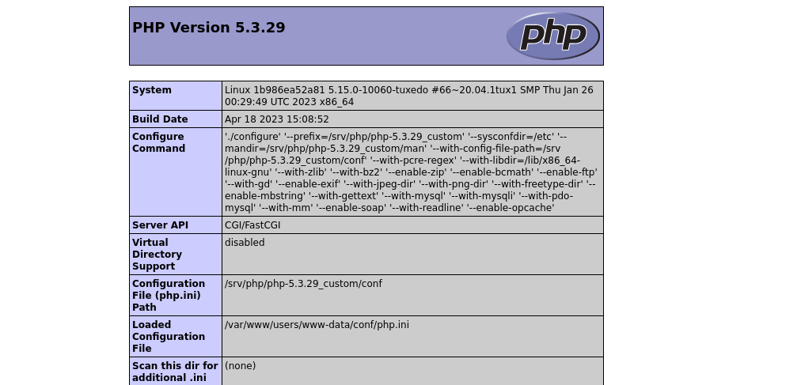

PHP 5.3 in a docker container
=============================

Usage
-----

    docker-compose up -d

It will serve the current directory using Apache and PHP 5.3 on <http://localhost:8123>.

Configuration can be adjusted `php.ini` and `apache.conf` in the `_docker` directory.

Run

    docker-compose down && docker-compose build && docker-compose up -d

afterwards.
